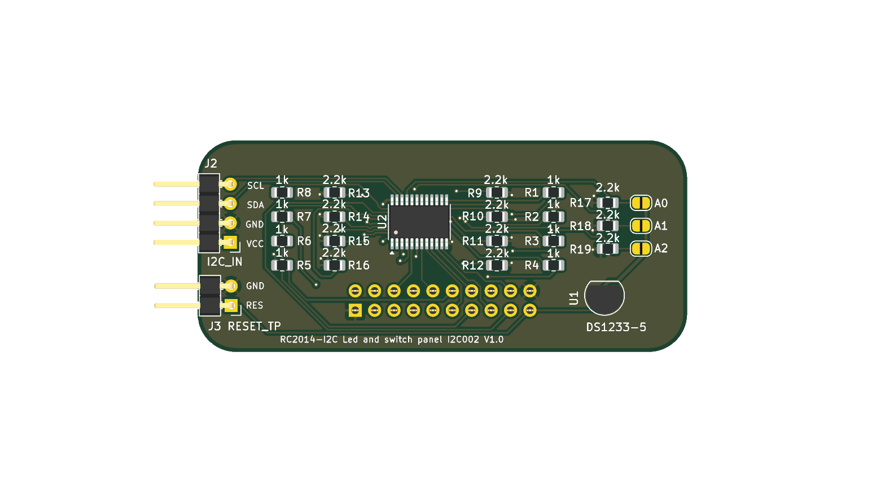
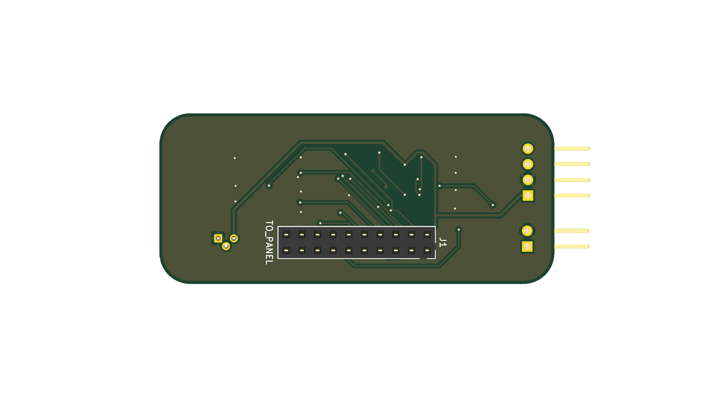
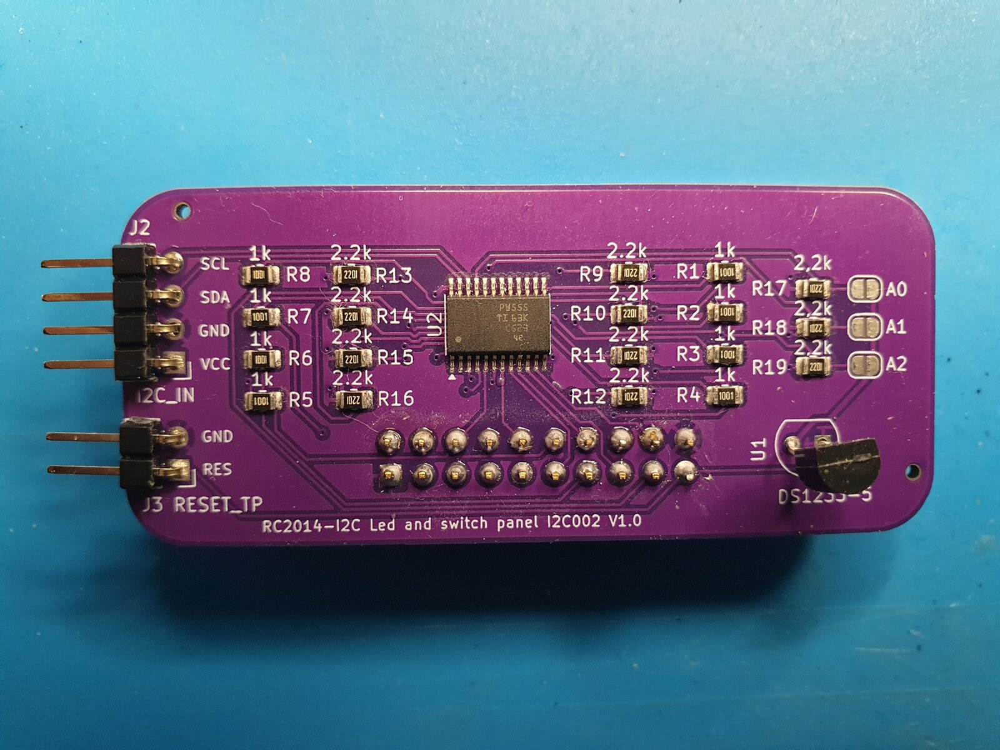
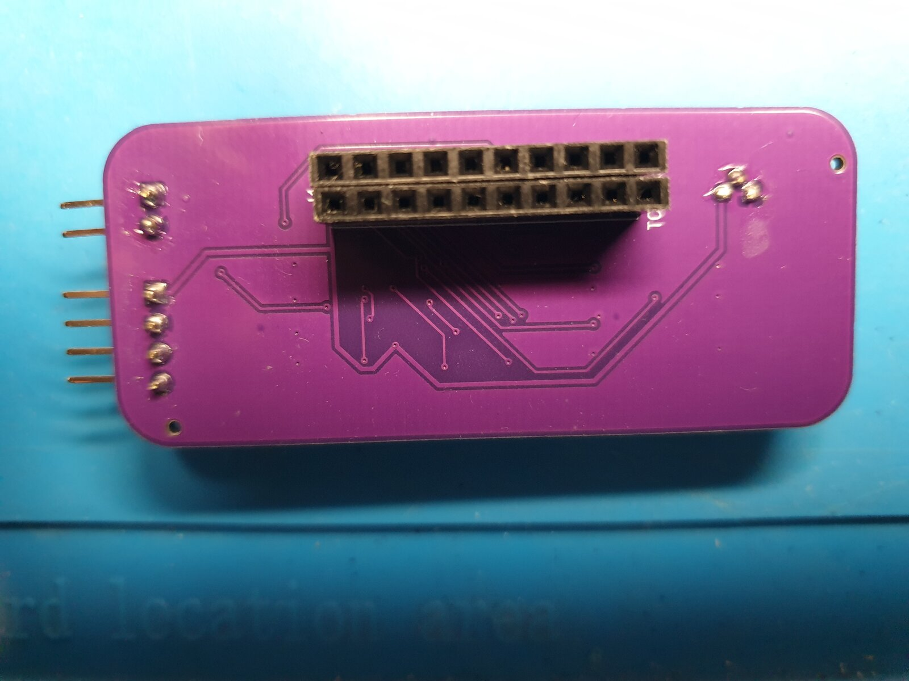

# Front Panel I2C Adapter, Designed For RC2014

An I2C adapter board for the RC2014 Blue Box front panel.

The RC2014 [Universal Front Panel I/O Kit](https://z80kits.com/shop/universal-front-panel-switch-and-led-for-romwbw/)
is one kit, but ships as two separate PCBs connected by a ribbon cable: the
**I/O Module** (plugs into the RC2014 backplane, decodes I/O port 0, drives
the LED/switch logic over the Z80 I/O bus, includes a DS1233 reset
supervisor) and the **Front Panel** (the physical board carrying the actual
8 switches and 8 LEDs plus reset switch/power LED, no logic of its own).

This adapter replaces the I/O Module only. The Front Panel board is
unchanged. This adapter's J1 is a female socket that mates directly onto
the Front Panel board's own male header, board-to-board, no cable involved.
It drives the same 8 switches/8 LEDs over I2C through a single TCA9555
16-bit I/O expander (one register bank for switch input, one for LED
output) instead of the Z80 I/O bus board.

 

Real board photos (phone camera, lighting still a work in progress):

 

> Note: z80kits also sells a larger "Blue Box Front Panel Kit for RomWBW"
> bundle, with the same two boards plus an LCD module and enclosure-specific
> parts for the Blue Box case. This adapter replaces the same I/O Module
> board in either kit.

## Status

Hardware-confirmed working, both directions (LEDs out, switches in),
including graceful degradation when the board is unplugged (system boots
fine without it, front panel simply reports not present). See `kicad/` for
the full schematic/PCB source, `fab/` for ready-to-order fabrication files,
and `images/` for reference renders.

## Ordering / building

`fab/` contains everything needed to order this board pre-assembled from
JLCPCB:

- `front_panel_i2c_adapter_gerbers.zip`, board gerbers/drill files
- `front_panel_i2c_adapter_bom_jlcpcb.csv`, BOM in JLCPCB's SMT
  assembly upload format
- `front_panel_i2c_adapter_cpl.csv`, component placement (CPL) file,
  same upload flow

Upload the gerbers zip under PCB, then the BOM + CPL pair under SMT
Assembly. Editable KiCad source (schematic + PCB + project + local
symbol/footprint libraries) is in `kicad/`.

## Connectors

- **J1 (Front Panel connector), watch the orientation.** J1 mates directly
  onto the Front Panel board's own male header, and pin 1 has to line up in
  the correct direction. There is no dedicated pin 1 marker on the
  silkscreen (an oversight, not fixed on this revision), but the "J1"
  reference text itself is silkscreened right next to pin 1, so that's
  your cue once it's soldered on. Check pin 1 against the schematic/KiCad
  source before mating the boards if in doubt.
- **J2 (`I2C_IN`), upstream I2C.** 4-pin header, the board's only external
  link to the bus: pin 1 VCC, pin 2 GND, pin 3 SDA, pin 4 SCL.
- **J3 (`RESET_TP`), reset breakout, needs a wire.** The board carries a
  DS1233-5 reset supervisor, wired-OR onto the same Reset net as the Front
  Panel board's manual reset switch (via J1 pin 19). That combined Reset
  net is broken out to J3, a 2-pin header (RESET, GND). J3 is not wired to
  anything else on the board. Run a wire from J3 to wherever the reset
  switch's net is accessible on your backplane, RC2014 backplanes don't
  expose `~RESET` at the card-edge slots directly.
- **JP1/JP2/JP3, TCA9555 address select.** Solder-bridge jumpers for the
  TCA9555's A0/A1/A2 address pins, open (unbridged) by default, giving the
  board's default I2C address of `0x20`. Bridge the corresponding jumper(s)
  to change the address, e.g. if you need more than one of this board on
  the same bus.

## RomWBW driver

Front panel support over I2C requires a matching change to RomWBW's HBIOS
front panel driver (`FP_DETECT`/`FP_SETLEDS`/`FP_GETSWITCHES`). That driver
is written and hardware-confirmed against this board, but not yet published
upstream, still going through a final review pass.

**Driver link: pending, will be added here once published.**

### Build config

Once the driver is available, these are the config values used to build
RomWBW against this board (RC2014 Zed/Zed Pro target). This board is a
plain I2C slave, it needs a working I2C bus master already on the system,
either a real PCF8584 chip or the bitbang driver, not both:

| Setting | Value | Meaning |
|---|---|---|
| `I2CPCFENABLE` | `TRUE` | Enable the PCF8584 I2C bus master (real chip). Mutually exclusive with `I2CBITENABLE` |
| `I2CBITENABLE` | `FALSE` | Enable the bitbang I2C bus master (SC137) instead of a real PCF8584 chip. Mutually exclusive with `I2CPCFENABLE`, set this `TRUE` and `I2CPCFENABLE` `FALSE` if you don't have a PCF8584 |
| `FPLED_ENABLE` | `TRUE` | Enable front panel LEDs |
| `FPSW_ENABLE` | `TRUE` | Enable front panel switches |
| `FP_USE_I2C` | `TRUE` | Drive the front panel over I2C instead of the Z80 I/O bus |
| `FP_I2CADR` | `$20` | TCA9555 7-bit I2C address, with A0/A1/A2 tied low (board default, adjust if you've jumpered a different address) |
| `FPLED_INV` | `FALSE` (default) | TCA9555 output is active-high, no inversion needed |

LEDs and switches share the one TCA9555 chip/address. Register select
(Port 0 = switches/input, Port 1 = LEDs/output) is handled by the driver,
not a config option.

## License

[CERN-OHL-W v2](LICENSE) (CERN Open Hardware Licence, Weakly Reciprocal
variant).
